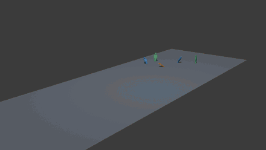
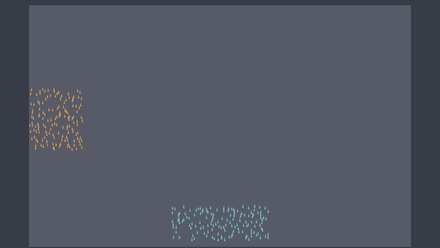
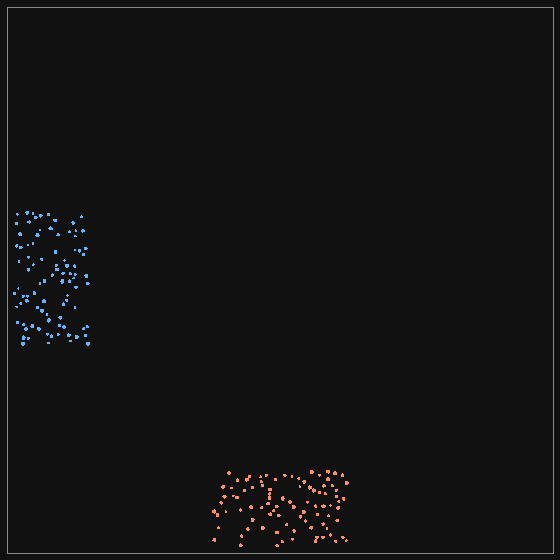

# Blender Crowd

Blender Crowd is a proposed Blender-native platform for authoring, simulating,
editing, caching, and rendering autonomous character crowds.

The project is designed around a high-performance deterministic simulation core,
with Blender serving as the authoring, debugging, layout, and rendering
environment. Geometry Nodes is a presentation and procedural-authoring layer,
not the authoritative simulator.

The canonical product and engineering contract is:

- [Blender Crowd 1.0 architecture and MVP](docs/blender-crowd-1.0.md)

The industrial capability target and its traceability to the delivery sequence
are documented in:

- [Industrial crowd capability and Blender integration roadmap](docs/industrial-crowd-capability-roadmap.md)
- [Milestone contract index](docs/milestones/README.md)

Research informing the avoidance, social-attention, scale, and animation-tier
decisions is summarized in:

- [Crowd simulation research synthesis](docs/crowd-simulation-research-2026.md)

The first release is intentionally focused: build a trustworthy pedestrian-crowd
pipeline for 1,000 interactive agents before expanding into semantic activities,
combat, traffic, motion matching, or 100,000-agent backgrounds. Those later
capabilities are deferred, not discarded: the milestone suite carries the
project from the 1.0 proof toward a Golaem-class Blender production workflow,
MASSIVE-style authorable agency, and an eventual Blender ecosystem/mainline
integration proposal backed by production evidence.

## Status

M0 through M3 are accepted. Blender Crowd 1.0 is narrowed to Blender 5.2 LTS
on macOS 11+ Apple Silicon. The implemented system includes a
headless deterministic Rust kernel, selected navigation and avoidance, a
recoverable versioned cache, an abi3 native facade, a clean-install Blender
extension, and cache-only Geometry Nodes presentation.

M2 adds typed behavior, semantic environments, groups and queues, production
variation, cached selected-agent evidence, terrain presentation, and sparse
corrections. Its [acceptance record](docs/benchmarks/2026-08-12-m2-acceptance.md)
separates the passing functional gate from the substantial UI/UX work that the
operator spot check exposed. That deferred work, including the incomplete Figma
artifact, is tracked in the [UI/UX roadmap](docs/ui-ux-roadmap.md#deferred-uiux-todo).

The M1 reference concourse compiles exactly 1,000 stable agents, performs a
strict 10,000-tick rebake, isolates a timed portal change, preserves all v1
playback channels, supports a reversible one-agent pin, and renders from a
completed cache after the simulation process is gone. See the
[M1 acceptance evidence](docs/benchmarks/2026-08-10-m1-vertical-slice.md) and
[standstill correction](docs/benchmarks/2026-08-11-standstill-correction.md),
plus the [clean-file walkthrough](docs/user/m1-reference-walkthrough.md).



The M1 reference concourse: 1,000 agents over the full 10,000-tick strict bake,
rendered in Blender 5.2 LTS from a **completed cache with no simulation session
in the process**. 96.4% of agents reach their destination with zero static-boundary
escapes. The `east_gate` portal closes at tick 600 and reopens at tick 900; the
65 routes that used it are invalidated and fully recovered by tick 907, and the
55 routes that did not use it are untouched.

This clip is a visualisation, not a measurement. Frames are rendered one at a
time with a cache sync between them, so neither its length nor its frame rate
says anything about playback or simulation speed; every 20th tick becomes a
frame, so it runs at roughly 20x simulation time by design. The measured
costs — simulation, cache write, cache read, point upload, armature evaluation,
Eevee, and Cycles CPU — are recorded separately in the
[M1 acceptance evidence](docs/benchmarks/2026-08-10-m1-vertical-slice.md).

Regenerate it with `scripts/make-m1-recording.sh` (needs Blender and `ffmpeg`).
It bakes a strict cache, clean-installs the extension, and records from that
cache; an `.mp4` and a `docs/media/m1-concourse-1000.json` sidecar naming the
exact cache manifest hash are written alongside the GIF.

The earlier `crossing` clips below are kept deliberately. M1 did not close the
flow-quality gap they show.



A 1,000-agent `crossing` bake played back inside Blender 5.2 LTS, coloured by
which stream each agent entered from: orange enters from the west heading east,
blue from the south heading north. Every frame is a Blender render of the point
cloud the shipped `TracePlayback` synced, instanced by the shipped node group.

This clip is a visualisation, not a measurement. Frames are rendered one at a
time with a sync between them, so neither its length nor its frame rate says
anything about playback speed; it runs at roughly 10x simulation time by
design. The measured playback cost is in the
[Blender bridge benchmark report](docs/benchmarks/2026-08-07-blender-bridge.md),
and it is reported separately from the bake that produced the trace.

It also shows the open problem, the same one the 600-agent GIF below shows: the
two streams jam where they intersect and only a trickle escapes. That is the
24% completion rate in the metrics, not a rendering artefact.

Regenerate it with `scripts/make-blender-recording.sh` (needs Blender and
`ffmpeg`). An `.mp4` of the same run is written alongside the GIF.



The `crossing` scene, 600 agents, `sampled_velocity` solver, seed 2026, coloured
by destination. It shows both the working part and the open problem: the streams
resolve into lanes, and they also jam hard where they intersect, which is the
quality gap the benchmark report quantifies. Regenerate it with
`scripts/make-gif.sh` (needs `ffmpeg`; the frames themselves come from
`crowd-bench run --frames` and need nothing extra).

Measured results, including where the current solver falls short:

- [Kernel slice 1 benchmark report](docs/benchmarks/2026-08-05-kernel-slice-1.md)
- [Avoidance solver comparison and production default](docs/benchmarks/2026-08-06-avoidance-solver-comparison.md)

## Development

Requires the pinned Rust toolchain in `rust-toolchain.toml`; `mise install`
sets it up. On macOS, `.cargo/config.toml` points the linker at the system
clang — without it, nothing links.

The Blender runners require Blender 5.2 LTS at
/Applications/Blender.app/Contents/MacOS/Blender (override with BLENDER=...).
On macOS they must run with normal host Metal access. Restricted automation
sandboxes can make `MTLCreateSystemDefaultDevice()` return `nil` and crash
Blender before Python starts. The M4 runner already enables Blender 5.2's
`--python-use-system-env` mode so its source add-on and native wheel paths are
available to the embedded interpreter.

```sh
cargo test --workspace                                    # unit, property, determinism
cargo test -p crowd-core --test behavior_graph            # M2 typed graph schema/compiler
scripts/m2-foundation-test.sh                             # implemented M2 compiler/data-layer checks
scripts/m2-blender-authoring-test.sh                      # M2 clean-install + UI-context undo/save/reload
scripts/blender-install-test.sh --python tests/blender/test_m3_production.py # M3 cache recovery/save-reload proof
scripts/m3-acceptance.sh --archive /path/to/blender_crowd-1.0.0.zip --out /tmp/blender-crowd-m3-proof # archive-first M3 gate
scripts/m2-full-acceptance.sh --out /path/to/blender-crowd-m2-proof      # 1K full bake/replay/debug/render subgate
scripts/m4-foundation-test.sh                         # M4 layer composition, v1 migration, cache-only bridge, and USD profile checks
scripts/m5-foundation-test.sh                         # M5 tier scheduling and cache-range streaming contracts
cargo run --release -p crowd-bench -- cache-experiment --agents 10000 --cache-frames 8 --out /tmp/blender-crowd-m5-cache-10k # M5 bounded cache preflight, not acceptance
# Full 10K/100K procedure: docs/runbooks/m5-scale-gates.md
scripts/m4-blender-test.sh                            # M4 1K/5K-tick layer UI, seven-agent correction, physics, procedural render, USD, reload proof
M4_ARTIFACT_DIR=/tmp/blender-crowd-m4-captures scripts/m4-blender-test.sh # retain M4 before/after and scale PNGs
cargo test --release -p crowd-core --test fuzz_density    # 800-agent density stress
cargo clippy --workspace --all-targets -- -D warnings

cargo run --release -p crowd-bench -- run --agents 1000 --svg --solver sampled_velocity
cargo run --release -p crowd-bench -- check --agents 1000 # regression against baselines
cargo run --release -p crowd-bench -- compare --out benchmarks/reports  # three-solver, four-scale bake-off

cargo run --release -p crowd-bench -- nav-reroute --agents 1000 --svg  # tiled-navmesh portal reroute (M0 item 4)
cargo test --release -p crowd-core --test two_room_reroute -- --ignored  # 1,000-agent reroute acceptance test
scripts/cache-experiment.sh                               # measured 1,000-agent cache matrix
scripts/m0-acceptance.sh                                  # complete ordered M0 gate + JSON evidence
cargo test --release -p crowd-core --test m1_strict -- --ignored --nocapture
scripts/m1-bake-test.sh                                   # two strict bakes + cancel/recovery proof
scripts/m1-blender-test.sh                                # clean project/cache/override/render suite
scripts/m1-render-test.sh --out /tmp/blender-crowd-m1-render  # detailed render metrics + PNGs

cargo run --release -p crowd-bench -- run --scene crossing --agents 600 --frames
scripts/make-gif.sh crossing 600                          # frames -> docs/media/crossing-600.gif

scripts/build-wheel.sh                                    # abi3 wheel -> addon/blender_crowd/wheels/
scripts/verify-wheel.sh                                   # trace + wheel round trip in a plain CPython
scripts/blender-install-test.sh                           # clean install + native module load
scripts/blender-playback-test.sh                          # 1,000-point playback, costs reported separately
scripts/make-blender-recording.sh crossing 1000           # playback clip -> docs/media/ (needs ffmpeg)
scripts/make-m1-recording.sh                              # M1 cache-only concourse clip -> docs/media/ (needs ffmpeg)

cargo run --release -p crowd-bench -- run --scene crossing --agents 1000 --trace
```

The M2 behavior-graph authoring foundation is documented in
[M2 behavior graph authoring](docs/user/m2-behavior-graph.md). It compiles
typed, bounded graph data in Rust and exposes the same validation through
Blender; the completed M2 runtime and operator evidence is linked from the
[M2 acceptance record](docs/benchmarks/2026-08-12-m2-acceptance.md).

The wheel build needs `maturin`, pinned in `mise.toml` and installed by
`mise install`. It is pinned through the `pipx:` backend (uv) rather than
`cargo:`, because building maturin from source happens outside this repo,
where the nix `cc` on `PATH` is the linker and cannot resolve libSystem.
Built wheels are not committed. The wheel is `abi3` on purpose: Blender 5.2
treats an `abi3` tag as "any CPython 3", so a single wheel survives Blender
moving to a newer CPython.

The M3 release contract is documented in the [support matrix](docs/release/1.0-support-matrix.md)
and [compatibility policy](docs/release/1.0-compatibility.md). Generate the
release SPDX inventory with `scripts/m3_sbom.py --out addon/blender_crowd/sbom.spdx.json`;
the wheel builder does this automatically before packaging.
The dated [M3 acceptance record](docs/benchmarks/2026-08-12-m3-acceptance.md)
records the reproducible archive, enforcing budgets, compatibility and
lifecycle drills, release-policy review, and accessibility audit. Independent
evaluator studies are deferred to M7. Windows, Linux, and Intel macOS are
explicitly outside the Blender Crowd 1.0 support contract.

Generated cache directories are intentionally not versioned. See the
[artifact storage policy](docs/release/artifact-storage-policy.md) for the
future 100-agent GitHub demo-fixture path and external hosting policy for
1,000-agent evidence and future 10K/100K artifacts.

`--svg` and `--frames` sample the simulation every tick, so a run recorded with
either reports a `ticks_per_second` that is not a performance measurement.
`--trace` also writes every tick to disk and is not an isolated simulation-
throughput measurement either: a wall-clock wrapped around a `--trace` run
includes that per-tick disk I/O plus the invoking process's own overhead
(e.g. cargo's freshness check), so it measures a bake (simulate + serialize),
not the simulator alone. Quote timings only from unrecorded runs.

`cargo test --workspace` runs the density fuzz in debug, which is slow; use the
release invocation above when iterating. The M0 acceptance runner executes the
rest of the workspace in debug and the density cases once in release so the
complete gate does not duplicate the same long stress tests in two profiles.

Baselines in `benchmarks/baselines/` record measured output, not targets. Per
the contract, quality thresholds are set only after a baseline is reviewed.
