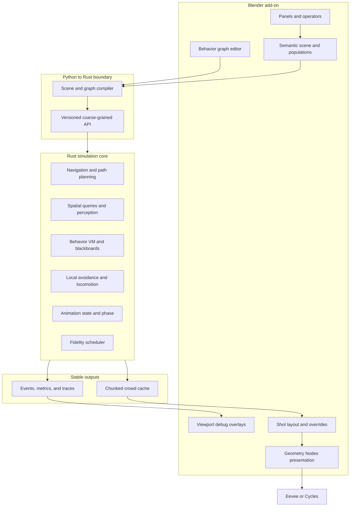

# Blender Crowd 1.0 architecture and MVP

Status: proposed canonical product and engineering contract
Target host: Blender 4.x LTS-compatible API surface
Implementation: Blender Python add-on, Rust simulation core, Geometry Nodes
presentation assets

## 1. Product decision

Blender Crowd 1.0 will be a Blender-native crowd authoring and shot-production
system, not another animated-character scatter tool. Its differentiator is a
complete, inspectable agent loop:

```text
perception -> context -> goals -> action selection -> locomotion -> animation
```

The long-term product is an open alternative to industrial crowd systems. The
1.0 MVP is narrower: an artist can define a pedestrian population, mark a
semantic environment, assign deterministic behaviors, simulate 1,000 agents,
inspect failures, make shot-level overrides, bake a portable cache, and render
the result without writing code.

The architecture must permit later growth to battles, traffic, richer
interactions, motion matching, and 100,000 background agents without making
those features 1.0 dependencies.

### 1.1 The 1.0 promise

Given a Blender scene containing rigged characters and a walkable environment,
an artist can:

1. Create one or more populations with weighted appearance and animation
   variation.
2. Tag walkable surfaces and meaningful destinations.
3. author a behavior graph from supported deterministic nodes.
4. preview and debug a crowd interactively.
5. simulate and bake repeatable results.
6. correct important agents or regions without resimulating an entire shot.
7. render instanced characters using Blender's normal pipeline.

### 1.2 Explicit non-goals for 1.0

The first release will not attempt to provide:

- an LLM invocation per simulated agent;
- a general-purpose visual programming language;
- physically complete combat, vehicles, or rigid-body character interaction;
- learned motion matching or generative animation;
- automatic conversion of arbitrary production rigs;
- distributed simulation;
- 100,000 fully autonomous, fully skinned hero agents;
- a bundled library of thousands of production-cleared human assets;
- live Geometry Nodes evaluation as the simulation source of truth.

These are roadmap candidates, not acceptance criteria for the first product.

## 2. Design principles

1. **Deterministic by default.** A scene, seed, engine version, and input asset
   set must reproduce the same cache on the same supported architecture.
2. **Blender-native authoring.** The artist works with Blender objects,
   collections, properties, node editors, viewport overlays, and undo.
3. **Simulation outside Blender's dependency graph.** Rust owns hot loops and
   authoritative state; Python orchestrates coarse operations.
4. **Data-oriented agents.** Runtime state is stored in structure-of-arrays
   buffers, not one Python or Rust object graph per character.
5. **Progressive fidelity.** Behavior, navigation, animation, and rendering
   fidelity are independent policies that can change with distance and shot
   importance.
6. **Inspectable decisions.** Every important agent decision can be explained
   through a trace, overlay, or recorded event.
7. **Authorial control wins.** Simulation is a starting point for a shot. Pins,
   guides, exclusions, local goals, time offsets, and hand-authored overrides
   are first-class data.
8. **Stable cache boundary.** Finished shots do not depend on rerunning the live
   simulator during rendering.

## 3. System architecture



### 3.1 Ownership boundaries

| Layer | Owns | Must not own |
|---|---|---|
| Blender Python | UI, scene extraction, asset validation, graph authoring, bake orchestration, cache attachment | Per-agent frame loops or avoidance hot paths |
| Rust core | Simulation clock, agent state, navigation, perception, behavior execution, avoidance, event log | Blender RNA objects, rendering, or UI state |
| Geometry Nodes | Cache visualization, instancing, material/mesh selection, renderer-facing LOD | Goals, path planning, collision avoidance, or authoritative state |
| Cache | Baked transforms, agent state channels, events, provenance, override layers | Source character meshes or opaque executable behavior |
| Blender scene | Authoring inputs and links to outputs | Hidden runtime-only state required to reproduce a bake |

This boundary keeps Blender responsive and makes headless simulation, testing,
and future DCC integrations possible.

### 3.2 Process model

The MVP ships the Rust core as a native Python extension loaded in Blender's
process. Calls are coarse-grained: compile scene, step N ticks, query a selected
agent, bake a range, or cancel. Rust releases the Python global interpreter lock
during simulation.

An out-of-process worker is a post-1.0 option for crash isolation and remote
simulation. It should not be the first integration because packaging and
cross-process scene synchronization would delay core validation.

### 3.3 Technology choices

| Concern | 1.0 choice | Reason |
|---|---|---|
| Core language | Rust | Safe parallelism, predictable native performance, Python-extension tooling |
| Python binding | PyO3 with a stable facade | Thin, testable Blender boundary |
| Parallel work | Rayon-style fixed worker pool | Simple CPU scaling without an async runtime in Blender |
| Numeric layout | `f32` SoA buffers, `f64` scene origin | Compact agent state with large-world origin management |
| Graph runtime | Compiled typed bytecode/IR | Deterministic, serializable, debuggable, cheaper than callbacks |
| Navigation | Tiled navmesh plus corridor pathing | Mature crowd-navigation model and incremental spatial scope |
| Local avoidance | ORCA/RVO-inspired solver with constraints | Practical reciprocal avoidance and deterministic CPU implementation |
| Cache | Versioned chunked binary plus JSON metadata | Streaming performance, inspectability, schema evolution |
| Rendering | GN instances driven by cache attributes | Blender-native variation and renderer compatibility |

Specific third-party crates and licenses must be selected through a separate
dependency review. The architecture does not require a particular navmesh or
ORCA library.

## 4. Authoring model

Blender Crowd adds five top-level data-block concepts. They are represented by
Blender objects, node trees, and property groups in authoring files, then
compiled into engine-owned immutable inputs.

### 4.1 Crowd Project

The project stores global settings:

```text
project UUID
engine/schema version
frames per second
simulation ticks per second
world-to-meter scale
global seed
cache path policy
navigation settings
default fidelity profile
```

The simulation tick is fixed and independent of viewport or render frame rate.
The default target is 30 Hz simulation sampled at the Blender scene frame rate.

### 4.2 Population

A population is a weighted rule set, not a list of duplicated characters.

```text
Population: Commuters
  spawn sources: platform_A, train_doors
  count: 800
  archetypes:
    adult_A: 0.40
    adult_B: 0.35
    adult_C: 0.25
  appearance sets:
    body mesh
    clothing collection
    material palette
    prop collection
  locomotion set: pedestrian_basic
  behavior profile: leave_station
  distributions:
    radius: 0.24m..0.38m
    preferred_speed: normal(1.35m/s, 0.18)
    patience: 0.2..0.9
  seed: derived from project and population UUID
```

Random values are derived from stable IDs, not iteration order. Adding one agent
must not reshuffle all existing variants.

### 4.3 Semantic environment

The MVP supports a deliberately small semantic vocabulary:

- `Walkable`: navigation source geometry;
- `Blocked`: excluded or dynamic obstacle geometry;
- `Portal`: a traversable doorway or connection with capacity;
- `Destination`: named goal region;
- `Queue`: ordered waiting region attached to a portal or destination;
- `Lane`: directional preference curve or strip;
- `Spawn`: population emission region;
- `Interest`: optional weighted attraction region;
- `Danger`: avoidance cost region.

Tags have stable IDs and typed properties. For example, a portal has width,
directionality, capacity, and open/closed state. Meaning is never inferred only
from an object's display name.

The semantic compiler produces:

1. a tiled navigation mesh;
2. a graph of regions, portals, and destinations;
3. spatial acceleration structures for queries;
4. validation errors for disconnected or contradictory authoring data.

### 4.4 Behavior graph

The artist-facing graph is strongly typed and intentionally constrained. It
compiles to an engine IR; Python node callbacks do not execute for each agent.

The 1.0 graph provides these node families:

| Family | MVP nodes |
|---|---|
| Inputs | time, position, speed, population parameters, semantic region, event |
| Perception | nearby agents, destination visible/reachable, portal state, region query |
| Blackboard | get/set typed value, cooldown, timer, counter |
| Decisions | selector, sequence, compare, probability, utility score, weighted choice |
| Goals | choose destination, follow leader, hold position, flee region |
| Actions | navigate, wait, queue, wander, follow lane, emit event |
| Group | assign group, group centroid, maintain cohesion, group arrival |
| Control | success/failure, interrupt, timeout, fallback |

The graph can express behavior-tree and utility-selection patterns without
exposing arbitrary loops or arbitrary code. Nodes declare read/write channels,
cost class, determinism guarantees, and debug labels.

Example commuter logic:

```text
Selector
  Sequence
    Is portal congested?
    Choose alternate exit by utility(distance, congestion)
    Navigate
  Sequence
    Wants optional interest stop?
    Navigate to interest region
    Wait randomized duration
  Navigate to assigned exit
```

Graph compilation rejects type mismatches, unreachable mandatory actions,
unknown semantic references, and unsupported cyclic execution.

### 4.5 Shot overrides

Overrides are sparse layers evaluated after the base cache. They do not mutate
the original bake.

MVP override types:

- disable or hide an agent;
- transform offset over a frame range;
- animation clip or phase override;
- appearance reassignment;
- goal change followed by local resimulation of a selected set and time range;
- pin to an authored Blender object/curve for a frame range.

Each override has an author, timestamp, target stable ID, frame range, and
priority. Conflicts are visible rather than silently resolved.

## 5. Runtime data model

### 5.1 Stable identity

Every project entity has a UUID. Every spawned agent has a stable 64-bit ID
derived from the project, population, spawn source, and spawn ordinal. IDs remain
stable across rebakes when unrelated authoring data changes.

### 5.2 Agent state

Hot state is organized as structure-of-arrays buffers:

```text
identity:
  agent_id, population_id, group_id, fidelity_tier
kinematic:
  position, orientation, velocity, desired_velocity, radius
navigation:
  nav_poly, corridor_handle, destination_id, path_status
behavior:
  graph_program, instruction_state, action_state, blackboard_handle
animation:
  locomotion_state, clip_id, normalized_phase, playback_rate
debug:
  decision_code, stall_reason, selected_flags
```

Variable-size paths, event histories, and blackboards live in pooled arenas and
are referenced by compact handles. The hot update loop does not allocate.

### 5.3 Blackboard schema

Graphs declare blackboard keys at compile time. Supported MVP value types are
boolean, integer, float, vector, stable entity ID, and small enum. Keys are
stored in typed columnar slots shared by agents using the same behavior program.
This avoids per-agent hash maps.

### 5.4 Events

Events are bounded, typed messages such as:

```text
entered_region(agent, region)
portal_closed(portal)
queue_joined(agent, queue)
goal_reached(agent, destination)
agent_stalled(agent, reason)
custom_graph_event(agent, event_type, payload)
```

Events may target an agent, group, population, or spatial region. Delivery is
ordered by tick, event type, and stable emitter ID to preserve determinism.

## 6. Simulation pipeline

The authoritative simulation uses a fixed-step clock. One tick runs these
phases with explicit synchronization boundaries:

1. **Apply inputs.** Consume timed scene events and authoring controls.
2. **Update spatial index.** Insert current agent bounds into a uniform grid or
   spatial hash.
3. **Perceive.** Query nearby agents and semantic features under a per-tier
   budget; write compact observations.
4. **Decide.** Execute behavior IR for agents whose decision interval is due.
5. **Plan.** Request or refresh high-level navmesh corridors; amortize path work.
6. **Steer.** Combine corridor direction, lane/cohesion terms, and local
   avoidance constraints into desired velocity.
7. **Integrate.** Advance kinematic state, project to navigable space, and record
   exceptional corrections.
8. **Animate.** Select locomotion state, phase, speed warp, and orientation.
9. **Emit.** Produce ordered events, diagnostics, metrics, and cache samples.

Parallel phases write only to their agent's next-state buffers or thread-local
event queues. Cross-agent reads come from the immutable previous phase. Event
queues are merged in a stable order.

### 6.1 Navigation

The MVP navigation stack is:

```text
semantic destination
  -> region/portal route
  -> tiled navmesh path
  -> polygon corridor
  -> smoothed local waypoint
  -> preferred velocity
  -> local avoidance velocity
```

The navmesh build supports agent-radius presets rather than arbitrary per-agent
meshes. Agents outside a preset use the nearest conservative radius class.

Path planning is budgeted and cached. Paths are invalidated by changed portal
state, a dirty navmesh tile, a changed destination, or sustained corridor
failure. Dynamic obstacles first affect local avoidance; only persistent or
topological changes trigger tile rebuilds or replanning.

### 6.2 Local avoidance

The baseline solver uses reciprocal velocity constraints over neighbors selected
from the spatial index. Inputs include preferred velocity, radius, maximum
speed, priority, and time horizon. Static boundaries contribute additional
constraints.

Production requirements beyond “agents do not overlap” include:

- no high-frequency direction oscillation under ordinary bidirectional flow;
- deterministic tie-breaking using stable IDs;
- density-aware speed reduction;
- configurable personal space;
- congestion and stalled-agent reporting;
- graceful fallback to stop/slow when no feasible velocity exists.

The MVP will benchmark ORCA-style solving against a simpler sampled-velocity
solver. The chosen implementation must pass quality scenes and the scale budget;
algorithm branding alone is not an acceptance criterion.

### 6.3 Groups and queues

Groups are lightweight constraints, not composite physics bodies. A group has a
leader or computed center, separation limits, and a regroup policy. Members use
cohesion as one steering/utility term and may temporarily separate at bottlenecks.

Queues use an explicit queue semantic with slots and admission capacity. Agents
reserve slots deterministically and advance when the preceding slot clears.
This is preferable to hoping collision avoidance spontaneously produces an
artistically readable line.

## 7. Animation architecture

### 7.1 MVP locomotion representation

Each locomotion set maps semantic states to compatible clips and metadata:

```text
idle
start
walk_forward
walk_left_arc / walk_right_arc
turn_left / turn_right
stop
optional jog_forward
```

Every clip is preprocessed into:

- duration and loop range;
- average root velocity and turn rate;
- foot-contact intervals;
- compatible source rig and retarget profile;
- transition tags;
- optional trajectory samples.

At runtime the engine outputs clip ID, phase, playback rate, root orientation,
and transition state. Blender evaluates the actual armature animation only for
visible characters at the appropriate render tier.

### 7.2 Root motion policy

The simulation trajectory is authoritative for MVP translation. Clip metadata
informs preferred speeds and phase, while limited speed warping reconciles the
clip with the solved trajectory. Foot locking and terrain-aware IK are applied
as Blender-side presentation corrections where available.

This is a pragmatic first step, not the final locomotion model. Motion matching
and motion-driven collision response require a richer trajectory database and
belong after the deterministic navigation/cache pipeline is proven.

### 7.3 Retarget and validation

1.0 supports a documented canonical humanoid contract plus explicit retarget
profiles. Import validation checks bone mapping, scale, forward axis, root bone,
clip loops, foot contacts, and missing actions. Arbitrary rigs are allowed only
after an artist supplies a valid profile.

## 8. Fidelity and scale architecture

Simulation and rendering fidelity are separate axes.

### 8.1 Simulation tiers

| Tier | Intended use | Behavior | Navigation and avoidance | Animation state |
|---|---|---|---|---|
| S0 | Hero/near | Every scheduled tick, full graph | Full corridor and neighbors | Full transitions and phase |
| S1 | Midground | Reduced decision frequency | Full nav, reduced neighbor/time horizon | Clip and phase |
| S2 | Background | Coarse state machine/goal | Flow-field or shared paths, sparse avoidance | Coarse clip and phase |
| S3 | Distant | Precomputed flow or cache-only | No individual reactive planning | Loop selection only |

Tier transitions occur only at deterministic tick boundaries and use hysteresis.
Camera distance may suggest a tier, but an artist can pin agents or populations.
Off-camera agents cannot simply freeze when they may later enter the shot.

### 8.2 Render tiers

| Tier | Representation |
|---|---|
| R0 | Full armature, full mesh/material, optional IK |
| R1 | Reduced bones or baked deformation, reduced mesh |
| R2 | Instanced low-poly mesh with clip texture/baked deformation strategy |
| R3 | Card, impostor, or aggregate representation |

The MVP must implement R0/R1-style character instancing and define the R2 cache
contract. A specific GPU vertex-animation implementation is a 10K milestone,
not required to validate the initial 1K simulator.

### 8.3 Scale gates

Scale claims are earned by reproducible benchmark scenes. Counts alone are not
sufficient; visual correctness, bake time, peak memory, and frame extraction are
recorded together.

| Gate | Agent mix | Required proof | Architectural unlock |
|---|---|---|---|
| 1K | Mostly S0/S1 | Full MVP station scene, deterministic rebake, interactive debug selection | Ship 1.0 |
| 10K | 10% S0/S1, 90% S2 | Urban/stadium scene, bounded memory, streaming cache, practical viewport proxy | Market as large-crowd capable |
| 100K | <=2% S0/S1, remainder S2/S3 | Background flow scene, GPU-friendly presentation, measured render extraction | Market as massive background crowd |

Initial engineering budgets, to be refined on a named reference workstation:

- 1K: at least real-time simulation at 30 ticks/s without armature evaluation;
- 10K: at least 10 simulation ticks/s or faster-than-real-time offline bake;
- 100K: offline bake with bounded memory and cache streaming; no promise of full
  reactive behavior for every agent.

All benchmark reports must record CPU, RAM, OS, Blender version, build profile,
scene hash, tick rate, wall time, peak memory, and quality/failure metrics.

## 9. Cache and reproducibility

### 9.1 Cache structure

```text
shot.crowd/
  manifest.json
  strings.bin
  agents.bin
  frames/
    000000-000119.chunk
    000120-000239.chunk
  events/
    000000-000999.chunk
  overrides/
    layout.layer
  metrics.json
```

The directory form is easy to stream and recover. A packed archive may be added
for interchange, but is not the working format.

`manifest.json` includes:

- cache schema and engine versions;
- project/scene UUID and source content hash;
- frame and tick ranges;
- units and coordinate convention;
- agent/population counts and channel schemas;
- compression and chunk index;
- global seed and determinism mode;
- asset references by stable logical ID;
- build/platform provenance;
- completeness and cancellation status.

### 9.2 Frame channels

Required per-agent samples are stable ID, position, orientation, scale, animation
clip, normalized phase, playback rate, visible/render tier, and behavior state.
Optional debug channels can be omitted from final caches.

Channels are independently compressed and quantized according to declared error
bounds. Chunks have checksums and are written atomically. A canceled bake leaves
a readable incomplete cache that is never mistaken for complete output.

### 9.3 Invalidation

Inputs are content-hashed by concern. A material change does not invalidate the
simulation. A character mesh change may invalidate presentation but not paths.
A behavior, semantic topology, agent radius, animation trajectory, or timed
event change invalidates the affected simulation range.

The UI explains the first invalidating difference rather than showing only a
generic “cache stale” state.

### 9.4 Determinism modes

- `Strict`: fixed worker behavior and conservative math path for tests,
  regression bakes, and interchange.
- `Fast`: parallel optimized execution with deterministic ordering goals but
  tolerance-based comparison across supported machines.

Exact cross-CPU floating-point identity is not promised until demonstrated.
Strict acceptance compares exact discrete decisions and bounded continuous
state tolerances unless the implementation proves bitwise stability.

## 10. Blender UX

### 10.1 Workspace flow

The add-on exposes a Crowd workspace with these tasks:

1. **Project:** units, clock, seed, cache, health summary.
2. **Assets:** character, rig, clips, variation rules, validation.
3. **Environment:** navmesh sources, semantic painting/tagging, connectivity.
4. **Population:** spawn regions, counts, profiles, group distribution.
5. **Behavior:** node graph, compile errors, presets, agent trace.
6. **Simulate:** preview controls, bake, cancel, progress, resource estimates.
7. **Layout:** cache layers, selection, overrides, local resimulation.
8. **Render:** GN attachment, render tiers, missing-asset checks.

### 10.2 Viewport debugging

Debug overlays are a product feature, not development leftovers:

- navmesh, region, portal, queue, lane, and danger visualization;
- path corridor and next target;
- desired versus solved velocity;
- avoidance neighbors and active constraints;
- current goal, action, animation state, and decision reason;
- density, flow, stalls, collisions, and throughput heatmaps;
- per-agent time-travel trace from cached decision events.

The UI supports “why did this agent do that?” by showing the last decisive graph
node, its inputs, selected alternative, and relevant event.

### 10.3 Error model

Errors must identify the scene entity and corrective action. Bake is blocked for
invalid units, missing navmesh reachability, graph compile errors, unsupported
rig mappings, duplicate stable IDs, and unwritable cache locations. Quality
warnings such as excessive density or clip speed mismatch remain visible but can
be overridden.

## 11. Public interfaces

### 11.1 Rust core API

The core facade is versioned around coarse operations:

```text
compile_project(project_ir) -> compiled_project | diagnostics
create_session(compiled_project, settings) -> session
step(session, tick_count) -> progress + metrics
query_agents(session, query) -> snapshots
trace_agent(session, agent_id, range) -> decision_trace
bake(session, range, cache_target, cancel_token) -> bake_report
load_checkpoint(cache, tick) -> session
```

No Rust API accepts Blender object pointers. Project IR is plain versioned data.

### 11.2 Python API

The Python module provides stable orchestration for the add-on and automation:

```python
project = crowd.compile_scene(bpy.context.scene)
report = project.validate()
session = project.create_session(seed=42, mode="STRICT")
session.bake(frame_start=1, frame_end=240, output=cache_path)
```

Headless Blender use is supported for validation and bakes. Python callbacks
inside the per-agent simulation loop are explicitly unsupported.

### 11.3 Geometry Nodes contract

The cache reader exposes named attributes with stable semantics:

```text
crowd_agent_id
crowd_population_id
crowd_position
crowd_rotation
crowd_scale
crowd_variant_id
crowd_clip_id
crowd_clip_phase
crowd_behavior_state
crowd_render_tier
crowd_visible
```

The shipped GN group selects character/appearance variants and presentation
tier. Users may extend downstream rendering without changing simulation state.

## 12. MVP scope and acceptance

### 12.1 Reference shot

The acceptance scene is a small transit concourse:

- 1,000 pedestrian agents from at least three character archetypes;
- two spawn regions and three destinations;
- a bidirectional corridor, a doorway bottleneck, a queue, and a closed/open
  portal event;
- individual preferred speeds and appearance variants;
- small social groups that remain coherent;
- an optional interest stop;
- rerouting when a portal closes;
- at least one shot-level pinned hero override;
- final baked playback and render without the simulation session active.

### 12.2 Functional acceptance criteria

1. A new user can assemble the reference shot from documented assets without
   editing Python or Rust.
2. All 1,000 agents receive stable IDs and reproducible variations.
3. Agents reach valid destinations, avoid static boundaries, and use explicit
   queues/portals.
4. Portal closure causes bounded replanning without corrupting unrelated paths.
5. Repeating a strict bake with unchanged inputs produces matching discrete
   states and positions within the declared tolerance.
6. A selected agent exposes a readable decision and navigation trace.
7. Bake cancellation is safe; a complete cache plays without the engine.
8. A sparse override changes the shot without modifying the base cache.
9. Headless validation and bake are supported.
10. The packaged add-on installs on the declared Blender/OS support matrix.

### 12.3 Quality metrics

The reference report includes:

- destination completion and median travel time;
- agent-agent penetration count, maximum depth, and duration;
- static-boundary violations;
- stalled agents and stall duration;
- oscillation/abrupt-turn count;
- portal and queue throughput;
- simulation wall time and ticks/s;
- peak resident memory;
- cache size and sequential playback throughput;
- graph, perception, pathing, avoidance, animation, and cache time shares.

Thresholds should be fixed only after a checked-in baseline is measured. The
release cannot replace missing thresholds with a subjective demo review.

### 12.4 MVP deliverables

- installable Blender add-on with Crowd workspace;
- native Rust extension for supported platforms;
- project/semantic/population/behavior authoring data;
- behavior graph compiler and MVP node library;
- tiled navigation, path corridors, local avoidance, groups, and queues;
- locomotion metadata importer and basic clip-state runtime;
- cache writer, reader, GN presentation group, and sparse overrides;
- viewport debug overlays and metrics report;
- reference characters/clips that are redistributable for testing;
- transit reference scene;
- user guide, node reference, cache schema, and headless bake example;
- automated unit, property, integration, determinism, performance, and package
  smoke tests.

## 13. Delivery plan

### Phase 0: proving grounds

Goal: retire the highest-risk assumptions outside polished UI.

- Define coordinate, unit, identity, clock, and determinism contracts.
- Build a Rust benchmark with 1,000 discs, spatial indexing, preferred velocity,
  and two avoidance candidates.
- Implement navmesh corridor following in a synthetic concourse.
- Measure behavior-IR execution and event ordering.
- Prototype 1,000 cached point transforms into Blender and GN instancing.
- Decide cache chunk sizes and quantization from measured playback.

Exit gate: a reproducible benchmark report selects the avoidance approach and
proves the bridge/cache path. A video alone is insufficient.

### Phase 1: vertical slice

Goal: one end-to-end crowd shot with deliberately narrow authoring.

- Project, population, spawn, destination, and walkable semantics.
- Fixed built-in commuter behavior, pathing, avoidance, locomotion state.
- Bake/cache/GN playback.
- Stable IDs, seeds, cancellation, and basic overlays.

Exit gate: 1,000 agents complete the simple concourse shot from a headless bake
and render from cache.

### Phase 2: authorable MVP

Goal: turn the vertical slice into a product rather than a demo.

- Typed behavior graph and validation.
- Portals, queues, lanes, interest and danger regions.
- Groups, events, rerouting, detailed traces, and metrics.
- Character/clip validation and weighted variation UI.
- Sparse overrides and local resimulation.

Exit gate: a non-developer reproduces the full reference shot using documentation
and passes the functional acceptance suite.

### Phase 3: 1.0 hardening

Goal: trustworthy installation and shot production.

- Performance and memory budgets on the support matrix.
- Cache recovery, invalidation, schema migration, and compatibility tests.
- Blender undo/save/reload and dependency-graph stress tests.
- Package signing/release pipeline and crash diagnostics.
- Documentation, example content, and license audit.

Exit gate: all 1.0 criteria pass from a clean installation and the release cache
renders without the simulator loaded.

### Phase 4: scale expansion after 1.0

Goal: earn 10K and then 100K claims.

- S2 shared-path/flow-field behavior and scheduled perception.
- GPU-friendly deformation/animation representation.
- background-cache streaming and render extraction.
- simulation/render tier promotion with hysteresis.
- benchmark scenes and published reports for each scale gate.

Motion matching, combat, vehicles, AI graph authoring, and asset marketplace work
should proceed as separate tracks only after the 1.0 data and cache contracts are
stable.

### 13.1 Team and indicative effort

This is planning guidance, not a calendar commitment. A credible 1.0 team is:

- two Rust/simulation engineers;
- one Blender/Python/GN engineer;
- one animation/technical-art engineer;
- one product-oriented technical artist or crowd TD;
- shared QA, packaging, documentation, and release engineering.

With that team, Phase 0 should be treated as a six-to-eight-week investment,
the vertical slice as another two-to-three months, the authorable MVP as three
to-five months, and 1.0 hardening as two-to-four months. In practice, a serious
cross-platform 1.0 is roughly a 9-to-14-month program after staffing, with asset
creation and unfamiliar Blender binary-packaging work capable of extending it.

A solo prototype can prove navigation, avoidance, cache playback, and a fixed
behavior in roughly one quarter, but should not be represented as the installable,
documented, production-hardened 1.0 defined here.

### 13.2 First 12-week execution slice

The first implementation contract should end in measured evidence, not a broad
add-on scaffold:

| Weeks | Outcome |
|---|---|
| 1-2 | Lock coordinate/clock/ID contracts; create benchmark and Blender add-on skeletons; establish CI and clean-install smoke test |
| 3-4 | Implement SoA agents, fixed tick, spatial queries, two-flow synthetic benchmark, deterministic seeds and metrics |
| 5-6 | Integrate navmesh/corridor prototype and compare avoidance solvers under crossing, bottleneck, and dense-flow scenes |
| 7-8 | Define cache v0, bake point transforms, stream them into Blender, and drive GN instance visualization |
| 9-10 | Add fixed commuter state machine, destination assignment, clip/phase channels, cancellation, and selected-agent trace |
| 11-12 | Assemble the 1K simple concourse vertical slice; publish performance/quality report and record architecture decisions |

At week 12, the go/no-go review asks whether avoidance quality, Blender playback,
native packaging, and cache throughput are jointly viable. A visually attractive
render without metrics and repeatable setup does not pass this gate.

## 14. Repository shape

The initial implementation should converge on:

```text
blender-crowd/
  addon/                 Blender Python package
    authoring/
    behavior_nodes/
    cache/
    debug/
    presentation/
  crates/
    crowd-core/          data-oriented simulation
    crowd-behavior/      graph IR/compiler/runtime
    crowd-nav/           navmesh, corridors, avoidance
    crowd-cache/         schema, streaming reader/writer
    crowd-python/        PyO3 facade
  schemas/               versioned IR/cache schemas
  geometry_nodes/        shipped GN assets and contracts
  assets/reference/      redistributable test rigs/clips
  scenes/                acceptance and benchmark scenes
  benchmarks/            runners, baselines, reports
  tests/                  cross-layer and package tests
  docs/                   architecture, user, node, cache docs
```

Crates may begin consolidated until profiling or ownership requires separation.
The module boundaries are contracts, not a demand for premature package count.

## 15. Verification strategy

### 15.1 Core tests

- unit tests for graph nodes, corridor logic, constraints, queues, and cache I/O;
- property tests for stable identity, bounded motion, and cache round trips;
- golden tests for graph IR and cache schema evolution;
- deterministic scenario snapshots with tolerance-aware continuous state;
- randomized density/bottleneck tests checked for NaNs, escape, and deadlock;
- microbenchmarks for spatial query, pathing, behavior, and avoidance.

### 15.2 Blender integration tests

- install/enable/disable add-on in clean Blender preferences;
- create, save, reload, validate, bake, attach cache, and render headlessly;
- undo/redo authoring operations;
- dependency-graph updates without hidden simulation mutation;
- missing/moved asset and stale-cache diagnostics;
- GN attribute compatibility and representative Eevee/Cycles renders.

### 15.3 Production failure drills

- cancel and resume or restart a long bake;
- corrupt or remove one cache chunk;
- load a newer/older schema version;
- close a portal under high density;
- introduce unreachable destinations;
- exceed memory/resource estimates;
- remove a referenced clip or character variant;
- change appearance-only data and confirm simulation cache remains valid.

## 16. Risks and decisions to validate early

| Risk | Consequence | Early experiment or mitigation |
|---|---|---|
| Blender armature evaluation dominates playback | Fast simulation still looks slow | Separate point-cache benchmark from visible rig tiers; test GN/deformation options |
| Avoidance looks robotic or deadlocks | Technically correct but unusable crowds | Quality scenes, explicit queues/lanes, measured oscillation and stall metrics |
| Python/Rust packaging breaks across Blender releases | Product cannot be installed reliably | Pin support matrix, automate clean-install smoke tests early |
| Graph becomes an untestable general language | Complexity and nondeterminism | Typed finite node set, compiled IR, no arbitrary hot-loop Python |
| Cache schema ossifies too early | Shot compatibility versus iteration conflict | Version every channel, readers tolerate optional fields, golden migration tests |
| Per-agent paths dominate at 10K+ | Scale ceiling below product ambition | Tiled caching now; flow/shared path research begins after 1K proof |
| Character assets and retargeting consume the roadmap | Simulator ships without usable content | Canonical rig and strict profile contract; small reference set first |
| “100K” becomes a misleading headline | Trust and product scope fail | Publish tier mix and quality metrics with every scale claim |

## 17. Post-1.0 roadmap ordering

The recommended order is driven by dependency and product value:

1. **10K background tier and GPU presentation.** Extends the proven cache and
   scheduler rather than changing agent semantics.
2. **Artist layout tools.** Curves, region retiming, group editing, cache layers,
   and stronger local resimulation make the simulator production-usable.
3. **Richer semantic activities and interactions.** Seats, doors, handoffs,
   paired actions, capacity/resource reservation, and activity schedules.
4. **Motion matching and trajectory-aware locomotion.** Build on stable clip,
   cache, and trajectory contracts.
5. **Traffic and combat domain packs.** Separate action/interaction libraries
   sharing core perception, behavior, navigation, and cache infrastructure.
6. **AI-assisted authoring.** Compile natural-language intent into a proposed,
   validated graph and population configuration. The artist reviews the diff;
   deterministic runtime behavior remains unchanged.
7. **100K background gate.** Earned after shared navigation and GPU presentation
   are proven at 10K.

## 18. Definition of Blender Crowd 1.0

Blender Crowd 1.0 is complete when the transit-concourse reference shot can be
authored without code, simulated repeatably with 1,000 autonomous pedestrians,
debugged at the level of an individual agent, corrected through sparse shot
overrides, baked to a recoverable versioned cache, and rendered from that cache
on the declared support matrix—with measured evidence for behavior quality,
performance, memory, and reproducibility.

Anything less is a technology prototype. Anything substantially broader should
be judged against the post-1.0 roadmap rather than allowed to delay this proof.
